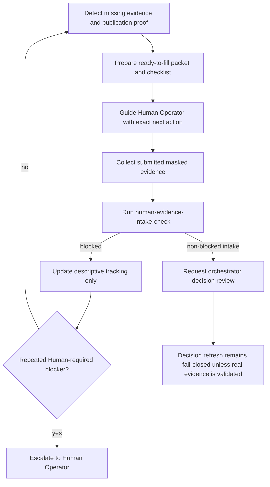

# ai占卜.ai Evidence & Publication Proof Sub-Loop Design 2026-06-20

## Purpose

This document defines a project-specific sub-loop for moving ai占卜.ai from prepared nonhuman assets to real, reviewable Human Operator evidence and manual publication proof.

The sub-loop is deliberately narrower than the main L1 loop. It does not try to make `execution_go=true`. It only detects missing evidence, prepares templates, guides Human action, records submitted proof status, and escalates cleanly when real Human Operator action is still missing.

## Current Baseline

| Field | Current value |
| --- | --- |
| project_decision | `no_go` |
| execution_go | `false` |
| evidence_present_yes | `0` |
| evidence_present_no | `10` |
| evidence_intake | `blocked` |
| main blocker | missing real Human Operator evidence and publication proof |

## Sub-Loop Stages

### 1. Detect

Detect current missing items from:

- `当前_Evidence_Gate_状态.md`
- `当前_Gate_Decision_摘要.md`
- `Human_Operator_Evidence_Packet_Template_2026-06-20.md`
- `Human_Operator_Evidence_Packet_Filling_Guide_2026-06-20.md`
- `Manual_Publication_Proof_Checklist_2026-06-20.md`
- `Post_Publication_Evidence_Collection_Template_2026-06-20.md`
- latest `human-evidence-intake-check.ps1` report

Output:

- missing Human Operator fields
- missing publication proof artifacts
- missing KPI row or timestamp
- missing masked demand/revenue signal, if applicable

### 2. Prepare

Use existing templates to generate a ready-to-fill packet for the next Human Operator action.

Safe outputs:

- prefilled checklist with unresolved fields still marked `todo`
- sanitized artifact path checklist
- one-page Human action brief
- evidence quality checklist

### 3. Guide

Generate concise Human instructions:

- which asset can be manually reviewed
- which fields must be filled
- what screenshots or public/channel proof are acceptable
- how to mask private data
- which validator command to run after submission

### 4. Collect & Verify

After Human Operator updates a real evidence file, run:

```powershell
& .\Codex_L1_Governance\scripts\human-evidence-intake-check.ps1 `
  -EvidenceFile ".\Codex_L1_Governance\Projects\ai占卜.ai\当前状态\当前_Evidence_Gate_状态.md" `
  -Json
```

The sub-loop may record validator output and missing fields. It must not decide final `real_go`.

### 5. Update

Update descriptive tracking fields in `L1_State.json.ai_divination_tracking` only.

Allowed updates:

- latest sub-loop report path
- current sub-loop phase
- last detected missing item summary
- next Human action
- failed_attempt_count
- escalation_needed

Forbidden updates:

- `execution_go=true`
- `present=yes`
- Revenue readiness
- gate pass/go state

### 6. Escalate

Escalate when:

- the same Human-required missing item appears in 2 consecutive sub-loop runs
- no publication proof is submitted after a prepared packet exists
- Human Operator fields remain `todo`
- a submitted artifact lacks timestamp, masking, or reviewable path

Escalation output:

- one paragraph Human intervention request
- exact missing fields
- exact file/template to fill
- validator command to rerun

## Flow Diagram



## Safe-Auto Boundary

| Action | Classification | Notes |
| --- | --- | --- |
| Generate missing-field summary | `safe_auto` | Read-only and descriptive |
| Generate Human action brief | `safe_auto` | Must keep unresolved fields as `todo` |
| Create ready-to-fill checklist | `safe_auto` | Template only |
| Run `human-evidence-intake-check.ps1` | `safe_auto` | Read-only validator |
| Update `L1_State.json.ai_divination_tracking` metadata | `safe_auto` | Descriptive metadata only |
| Select final publication asset | `human_required` | Human policy and account judgment required |
| Publish content | `human_required` | No auto-posting |
| Capture real proof screenshot | `human_required` | Must be real and masked |
| Set `present=yes` | `human_required` | Only after real masked evidence exists and reviewer accepts |
| Set `execution_go=true` | `forbidden` | Requires full gate process, not this sub-loop |
| Generate or infer revenue proof | `forbidden` | Must be real masked evidence |

## Suggested L1_State Fields

Add or maintain these under `ai_divination_tracking.evidence_publication_sub_loop`:

```json
{
  "status": "designed",
  "current_phase": "detect",
  "last_run_at": "todo",
  "last_detected_missing_items": [],
  "prepared_packet_path": "",
  "latest_validator_report": "",
  "failed_attempt_count": 0,
  "escalation_needed": false,
  "next_human_action": "Fill Human Operator evidence packet and one publication proof packet with real masked artifacts.",
  "safe_auto_allowed": [
    "detect_missing_items",
    "prepare_checklists",
    "generate_human_brief",
    "run_intake_validator",
    "update_descriptive_tracking"
  ],
  "human_required": [
    "publish_content",
    "capture_real_masked_proof",
    "submit_real_operator_attestation",
    "approve_candidate_present_yes"
  ],
  "forbidden": [
    "set_execution_go_true",
    "fabricate_evidence",
    "convert_present_no_to_yes_without_real_artifact",
    "claim_revenue_readiness_without_masked_revenue_evidence"
  ]
}
```

## Initial Runnable Sub-Loop Prompt

```markdown
/goal
Run the ai占卜.ai Evidence & Publication Proof Sub-Loop in fail-closed mode.

Inputs:
- Codex_L1_Governance/Projects/ai占卜.ai/当前状态/当前_Evidence_Gate_状态.md
- Codex_L1_Governance/Projects/ai占卜.ai/当前状态/当前_Gate_Decision_摘要.md
- Codex_L1_Governance/Projects/ai占卜.ai/当前状态/Human_Operator_Evidence_Packet_Template_2026-06-20.md
- Codex_L1_Governance/Projects/ai占卜.ai/当前状态/Human_Operator_Evidence_Packet_Filling_Guide_2026-06-20.md
- Codex_L1_Governance/Projects/ai占卜.ai/当前状态/Manual_Publication_Proof_Checklist_2026-06-20.md
- Codex_L1_Governance/Projects/ai占卜.ai/当前状态/Post_Publication_Evidence_Collection_Template_2026-06-20.md

Steps:
1. Detect missing Human Operator fields, publication proof fields, KPI fields, and masked demand/revenue evidence candidates.
2. Prepare one concise Human action brief with exact files to fill.
3. Run human-evidence-intake-check.ps1 in read-only mode.
4. Update only descriptive `L1_State.json.ai_divination_tracking.evidence_publication_sub_loop` fields.
5. If the same Human-required blocker repeats, create an escalation request.

Constraints:
- Do not publish content.
- Do not fabricate evidence.
- Do not change `present=no` to `present=yes`.
- Do not change `execution_go=false`.
- Do not claim Revenue readiness.

Output:
- Missing item summary
- Human action brief
- Validator result summary
- Updated descriptive tracking fields
- Escalation request if needed
```

## Implemented Detect + Prepare Script

The initial repeatable implementation is:

```powershell
& .\Codex_L1_Governance\scripts\ai-divination-evidence-publication-sub-loop.ps1 `
  -GovernanceRoot ".\Codex_L1_Governance" `
  -Json
```

The script:

- discovers the current sanitized Evidence Gate and Gate Decision files
- detects missing Human Operator fields and unresolved EV rows
- runs `human-evidence-intake-check.ps1` in read-only mode
- generates a structured missing-item list and Human task checklist
- writes Markdown and JSON reports under `当前状态/sub_loop_reports/`

It does not update evidence rows or gate decisions.

## Main L1 Loop Integration

- The main L1 loop may invoke this sub-loop when `ai_divination_tracking.status` is blocked but support templates exist.
- The sub-loop output should feed `reflect-and-improve.ps1` as project-specific context.
- If the sub-loop remains blocked for 2 runs, Reflector should classify it as `external_block`, not `prompt`.
- The sub-loop never overrides the main gate chain.

## Compliance Boundary

This design is a governance guide only. It does not submit Human evidence, publish content, change gate decisions, change revenue readiness, or authorize production execution.
