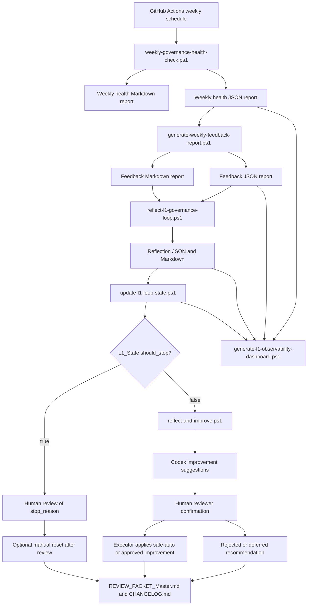

# L1 Self-Run And Self-Evolution Architecture

## Purpose

This document defines how `Codex_L1_Governance` runs recurring health checks, converts results into feedback, and evolves through Codex-assisted but human-approved changes.

The goal is self-running governance, not self-authorizing execution.

## Architecture



## Layers

| Layer | Components | Responsibility | Boundary |
| --- | --- | --- | --- |
| Execution layer | GitHub Actions, `weekly-governance-health-check.ps1`, validation scripts | Run read-only or dry-run checks on a cadence | Does not change gates or evidence |
| Monitoring and feedback layer | `weekly_health_reports/`, `feedback_reports/`, `reflection_reports/`, feedback templates | Convert check results into issues, 12D assessment, root cause, and recommendations | Advisory only |
| State and stopping layer | `L1_State.json`, `update-l1-loop-state.ps1` | Track iteration, score, execution_go, estimated cost, no-progress count, and stop reason | Does not trigger Executor |
| Improvement advisory layer | `reflect-and-improve.ps1`, `improvement_reports/` | Consolidate Codex improvement suggestions before Human review | Report-only |
| Observability layer | `generate-l1-observability-dashboard.ps1`, `observability_reports/`, `L1_Observability_Dashboard.md` | Provide one read-only dashboard for audit and handoff | Does not change state |
| Evolution layer | Codex review, Human reviewer, `.codex/agents/`, `AGENTS.md`, Skill registry, scripts | Propose and apply safe-auto or approved governance improvements | Low-risk docs/templates can be safe-auto; high-risk changes require Human confirmation |

## Implementation Roadmap

| Phase | Goal | Current implementation | Exit criteria |
| --- | --- | --- | --- |
| 1. Basic automation | Run weekly L1 health without manual command entry | Active GitHub Actions workflow runs health and feedback generation | Reports are generated and committed |
| 2. Feedback loop | Convert health results into structured improvement recommendations | Markdown and JSON feedback reports exist | Human reviewer can approve or reject proposed changes |
| 3. Reflect and stop | Analyze root cause and update loop stopping state | Reflector and state updater scripts exist | `L1_State.json` controls whether Executor may proceed |
| 4. Improve and observe | Produce advisory Codex suggestions and a unified dashboard | `reflect-and-improve.ps1` and dashboard script exist | Human reviewer has one review packet before approving changes |
| 5. Intelligent evolution | Codex proposes targeted updates from recurring patterns | Sub-agent roles are documented; automatic mutation is prohibited | Repeated issues become approved rules, scripts, or failure cases |

## Component Responsibilities

| Component | Responsibility |
| --- | --- |
| `.github/workflows/weekly-governance-health-check.yml` | Runs weekly health check, generates feedback, commits generated reports |
| `scripts/weekly-governance-health-check.ps1` | Orchestrates closeout, artifact hygiene, and secret-shape checks |
| `scripts/generate-weekly-feedback-report.ps1` | Converts weekly health JSON into Markdown and JSON feedback reports |
| `scripts/reflect-l1-governance-loop.ps1` | Converts health, feedback, and state into root-cause reflection reports |
| `scripts/update-l1-loop-state.ps1` | Applies stopping conditions, preserves extended state, allows bounded retry, and appends bounded `loop_history` records |
| `scripts/reflect-and-improve.ps1` | Generates advisory Codex improvement suggestions from latest health, feedback, reflection, and state |
| `scripts/generate-l1-observability-dashboard.ps1` | Generates the read-only L1 observability dashboard |
| `L1_State.json` | Tracks iterations, score, execution_go trend, estimated cost, repeated failure category, and stop reason |
| `.codex/agents/healthchecker.md` | Defines the health-only sub-agent role |
| `.codex/agents/reflector.md` | Defines the advisory root-cause reflection sub-agent role |
| `.codex/agents/executor.md` | Defines the Human-approved executor role and `should_stop=false` preflight |
| `self_evolution/templates/` | Defines the expected feedback report shape |
| `AGENTS.md` | Defines mandatory safety, cadence, notification, and approval rules |
| `REVIEW_PACKET_Master.md` | Records durable governance decisions and validation results |
| `CHANGELOG.md` | Records user-visible L1 governance changes |
| Codex | Drafts improvement proposals and implements approved changes |
| Human reviewer | Confirms changes that affect rules, scripts, gates, evidence, or automation activation |

## Self-Evolution Triggers

Codex may propose improvements when any of these are true:

- weekly health status is `blocked` or `conditional`
- the same issue appears in two or more weekly feedback reports
- a proposed Skill is used operationally but remains unpromoted
- an audit checklist item remains pending for more than one review cycle
- project records show repeated confusion between L1 health and project readiness
- artifact, feedback, or review packet records become stale

## Auto-Allowed Actions

These actions may run automatically:

- generate weekly health reports
- generate feedback reports
- generate reflection reports
- update `L1_State.json` with stopping-condition fields
- generate Codex improvement suggestion reports
- generate observability dashboards
- append bounded loop-history records for every state update
- commit generated reports from the scheduled workflow
- run read-only and dry-run validators
- record advisory recommendations

## Stopping Conditions

The L1 loop must stop for Human review when any hard stopping condition is reached. Priority order:

1. `cost_limit_reached`: estimated loop cost reaches `max_cost_usd`.
2. `max_iterations_reached`: iteration count reaches `max_iterations`.
3. `no_progress`: score does not improve and `execution_go` does not move from `false` to `true` for `no_progress_threshold` consecutive updates.
4. `repeated_failure_category`: the same Reflector failure category reaches `repeated_failure_threshold`; default is 2.

`L1_State.json` records estimated cost only. It does not read or claim real API billing.

## Recoverable Reflection Flow

Reflector now distinguishes:

- `prompt`: unclear or overbroad goal shape
- `context`: missing source-of-truth, stale handoff, or insufficient local context
- `tool`: failed or inconclusive script/workflow/parser/validator path
- `logic`: inconsistent L1 rules or state transition reasoning
- `data`: malformed data, secret-shape findings, or invalid evidence structure
- `environment`: runtime or platform condition
- `cost`: estimated budget limit
- `external_block`: Human Operator, real publication, revenue evidence, credentials, or other outside action required

If Reflector returns `recoverable=true`, the state updater may record a soft stop reason and spend one `auto_retry_count` slot before hard-stopping.

Allowed recoverable actions:

- generate a smaller next-goal context pack
- add missing source-file context
- rerun one read-only validator
- create a tool failure summary

Disallowed recoverable actions:

- changing gates
- setting `execution_go=true`
- changing `present=no` to `present=yes`
- fabricating Human Operator evidence
- enabling real webhook delivery
- touching provider, payment, production, or secret state

Cost and max-iteration limits remain hard stops. `data` and `external_block` are not recoverable by automation.

## Stop Recovery

When `should_stop=true`, Executor is blocked. A Human reviewer may reset the stop state only after reviewing the `stop_reason`.

Allowed reset command:

```powershell
& .\Codex_L1_Governance\scripts\update-l1-loop-state.ps1 -ResetStop -ResetReason "Human reviewed stop reason and approved another observation loop." -Json
```

Resetting `should_stop` does not approve gate changes, evidence changes, revenue work, or Executor action. It only permits another observation loop.

## Human Confirmation Required

These actions require explicit human approval:

- changing any gate decision
- changing `present=no` to `present=yes`
- filling `submitted_by` or other Human Operator fields
- enabling real webhook delivery
- moving workflow examples into active scheduler locations, except the approved weekly health workflow in this repository
- promoting a Skill to `active`
- changing production, payment, provider, secret, or revenue configuration

## Failure Behavior

The system fails closed:

- `blocked` health checks still generate reports.
- `blocked` or `conditional` findings remain visible in JSON and Markdown.
- generated feedback is advisory and cannot override gate state.
- generated reflection is advisory and cannot trigger high-risk Executor work by itself.
- Executor may safe-auto only low-risk governance docs/templates/indexes/reports/descriptive metadata when `should_stop=false`.
- `should_stop=true` blocks non-read-only Executor work and requires Human review.
- ai占卜.ai remains `no_go` until real project evidence is submitted and reviewed.

## Current Capability Assessment

| Capability | Status |
| --- | --- |
| Weekly self-run | implemented |
| Structured feedback | implemented |
| Reflector node | implemented |
| Stopping conditions | implemented |
| Stop recovery | implemented with Human-confirmed reset |
| Codex improvement suggestions | implemented as report-only |
| Observability dashboard | implemented |
| Sub-agent role definitions | documented |
| Codex improvement workflow | documented |
| Human confirmation boundary | implemented in rules |
| Automatic gate mutation | intentionally not implemented |
| Project-level evidence completion | blocked until Human Operator action |
