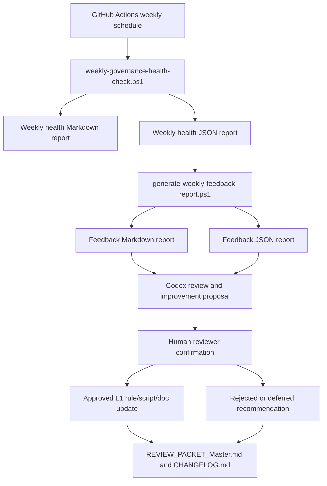

# L1 Self-Run And Self-Evolution Architecture

## Purpose

This document defines how `Codex_L1_Governance` runs recurring health checks, converts results into feedback, and evolves through Codex-assisted but human-approved changes.

The goal is self-running governance, not self-authorizing execution.

## Architecture

## Layers

| Layer | Components | Responsibility | Boundary |
| --- | --- | --- | --- |
| Execution layer | GitHub Actions, `weekly-governance-health-check.ps1`, validation scripts | Run read-only or dry-run checks on a cadence | Does not change gates or evidence |
| Monitoring and feedback layer | `weekly_health_reports/`, `feedback_reports/`, feedback templates | Convert check results into issues, 12D assessment, and recommendations | Advisory only |
| Evolution layer | Codex review, Human reviewer, `AGENTS.md`, Skill registry, scripts | Propose and apply approved governance improvements | Human confirmation required for durable changes |

## Implementation Roadmap

| Phase | Goal | Current implementation | Exit criteria |
| --- | --- | --- | --- |
| 1. Basic automation | Run weekly L1 health without manual command entry | Active GitHub Actions workflow runs health and feedback generation | Reports are generated and committed |
| 2. Feedback loop | Convert health results into structured improvement recommendations | Markdown and JSON feedback reports exist | Human reviewer can approve or reject proposed changes |
| 3. Intelligent evolution | Codex proposes targeted updates from recurring patterns | Codex process is documented; automatic mutation is prohibited | Repeated issues become approved rules, scripts, or failure cases |

## Component Responsibilities

| Component | Responsibility |
| --- | --- |
| `.github/workflows/weekly-governance-health-check.yml` | Runs weekly health check, generates feedback, commits generated reports |
| `scripts/weekly-governance-health-check.ps1` | Orchestrates closeout, artifact hygiene, and secret-shape checks |
| `scripts/generate-weekly-feedback-report.ps1` | Converts weekly health JSON into Markdown and JSON feedback reports |
| `self_evolution/templates/` | Defines the expected feedback report shape |
| `AGENTS.md` | Defines mandatory safety, cadence, notification, and approval rules |
| `REVIEW_PACKET_Master.md` | Records durable governance decisions and validation results |
| `CHANGELOG.md` | Records user-visible L1 governance changes |
| Codex | Drafts improvement proposals and implements approved changes |
| Human reviewer | Confirms changes that affect rules, scripts, gates, evidence, or automation activation |

## Self-Evolution Triggers

Codex may propose improvements when any of these are true:

- weekly health status is `blocked` or `conditional`
- the same issue appears in two or more weekly feedback reports
- a proposed Skill is used operationally but remains unpromoted
- an audit checklist item remains pending for more than one review cycle
- project records show repeated confusion between L1 health and project readiness
- artifact, feedback, or review packet records become stale

## Auto-Allowed Actions

These actions may run automatically:

- generate weekly health reports
- generate feedback reports
- commit generated reports from the scheduled workflow
- run read-only and dry-run validators
- record advisory recommendations

## Human Confirmation Required

These actions require explicit human approval:

- changing any gate decision
- changing `present=no` to `present=yes`
- filling `submitted_by` or other Human Operator fields
- enabling real webhook delivery
- moving workflow examples into active scheduler locations, except the approved weekly health workflow in this repository
- promoting a Skill to `active`
- changing production, payment, provider, secret, or revenue configuration

## Failure Behavior

The system fails closed:

- `blocked` health checks still generate reports.
- `blocked` or `conditional` findings remain visible in JSON and Markdown.
- generated feedback is advisory and cannot override gate state.
- ai占卜.ai remains `no_go` until real project evidence is submitted and reviewed.

## Current Capability Assessment

| Capability | Status |
| --- | --- |
| Weekly self-run | implemented |
| Structured feedback | implemented |
| Codex improvement workflow | documented |
| Human confirmation boundary | implemented in rules |
| Automatic gate mutation | intentionally not implemented |
| Project-level evidence completion | blocked until Human Operator action |
